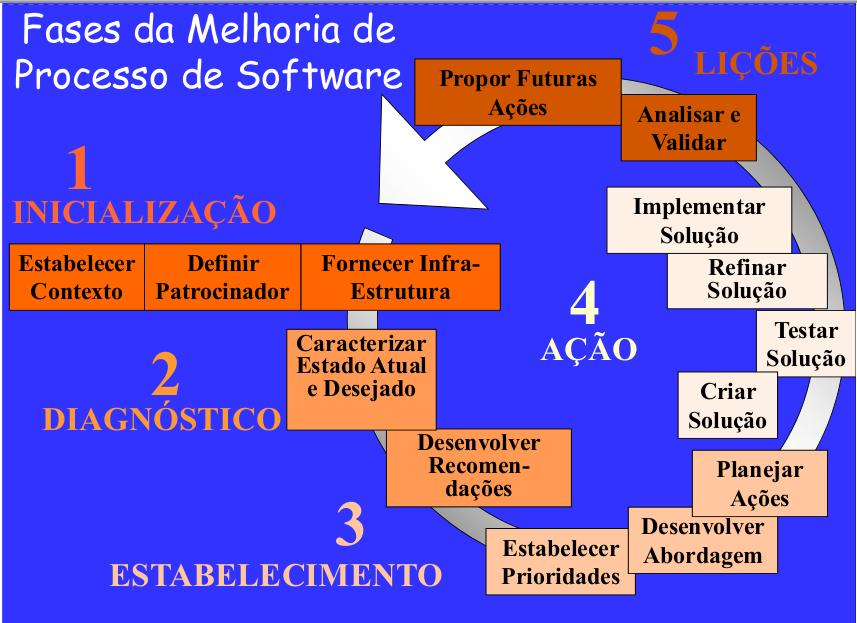

# Modelo de Melhoria de Processo de Software

## Introdução

Um processo de software é o conjunto de atividades e procedimentos que são executados com o objetivo de construir um produto de software. Para que o produto a ser obtido tenha uma qualidade alta, é importante que o seu processo de fabricação, ou seja, o processo utilizado para produzir o produto de software seja efetivo e melhorado continuamente. O ato de melhorar um processo de software é denominado Melhoria de Processo de Software, ou SPI.

Um modelo de melhoria de processo de software é um modelo que define atividades, práticas, artefatos e uma metodologia no geral para realizar a melhoria de um processo de software já existente. Estes modelos são úteis porque são padronizados, testados em diferentes situações e funcionam como um guia para realizar a melhoria de um processo.

Existem vários modelos que podem ser utilizados para realizar a melhoria de processo de software, cada um com suas vantagens e desvantagens, podendo ser aplicados em diferentes contextos. No contexto da empresa **Go Horse +**, o modelo a ser utilizado é o **Modelo IDEAL**.

Durante um programa de melhoria de processo de software é importante seguir um modelo para ter um rumo e conseguir ter melhores resultados durante a execução deste programa. No contexto da matéria de Melhoria de Processo de Software foi designado ao grupo utilizar o modelo IDEAL \(Initiating-Diagnosing-Establishing-Acting-Learning\).

## O Modelo IDEAL

O modelo IDEAL, é um modelo para Melhoria de Processo de Software, desenvolvido pelo Software Engineering Institute. Ele descreve um modelo de programa de melhoria de processos de software \(SPI\), que pode ser usado para orientar o desenvolvimento de um plano integrado de longo alcance para iniciar e gerenciar um programa SPI.

O modelo IDEAL, descreve cinco fases \(Fígura 1\) de uma iniciativa de SPI que fornecem um loop contínuo através das etapas necessários para o SPI.

