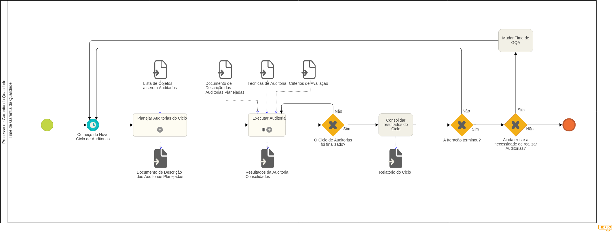
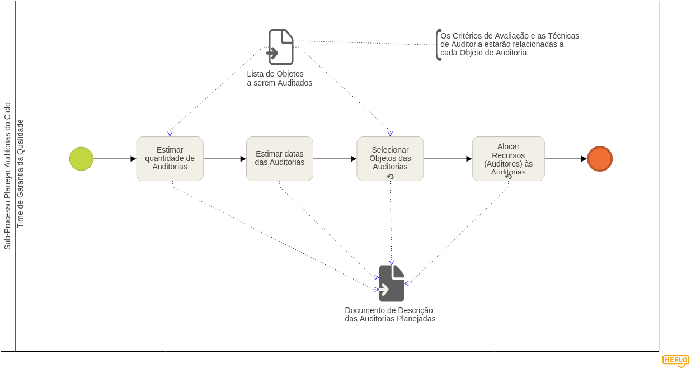
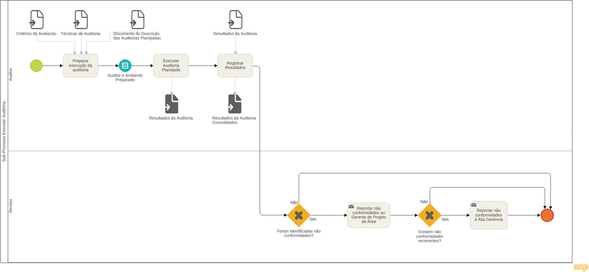

# Processo de Gestão de Qualidade

## 1. Introdução

Este artefato tem por objetivo disponibilizar o processo de garantia da qualidade modelado pela equipe responsável por este projeto, a explicação das atividades e sub processos destes estão descritas em Descrição do Processo.

## 2. Processos

#### 2.1 Processo de Garantia da Qualidade

#### 2.2 Sub-Processo Planejar Auditorias do Ciclo

#### 2.3 Sub-Processo Executar Auditoria

## 3. Descrição de atividades do processo

Após a mudança de times, os demais grupos de Garantia da Qualidade\(GQA\) devem começar o processo a partir do subprocesso Planejar Auditorias do Ciclo do processo geral.

### 3.1. Sub processo Planejar Auditorias do Ciclo

**ESTIMAR QUANTIDADES DE AUDITORIAS**

| **Descrição** | Nesta atividade, é considerada a lista dos objetos a serem auditados, para definir quantas auditorias serão necessárias para atender tal demanda. Contribuindo na criação do documento de descrição das auditorias planejadas. |
| :--- | :--- |
| **Responsáveis** | Time da Garantia da Qualidade |
| **Envolvidos** | N/A |
| **Entradas** | Lista de Objetos a serem Auditados |
| **Saídas** | Documento de Descrição das Auditorias Planejadas |

**ESTIMAR DATAS DAS AUDITORIAS**

| **Descrição** |  A partir da quantidade de auditorias estimadas na atividade anterior, é feita a estimativa das datas das auditorias para que se possa indicar quando serão feitas as auditorias no ciclo corrente. |
| :--- | :--- |
| **Responsáveis** | Time da Garantia da Qualidade |
| **Envolvidos** | N/A |
| **Entradas** | N/A |
| **Saídas** | Documento de Descrição das Auditorias Planejadas |

**SELECIONAR OS OBJETOS DAS AUDITORIAS**

| **Descrição** |  Nesta atividade são selecionados os objetos para cada uma das auditorias até que não existam mais auditorias previstas para o ciclo. É nesta atividade que se define o grau de complexidade da auditoria, uma vez que técnicas e critérios de avaliação para cada objeto já foram definidas no Processo de Preparação para GQA. |
| :--- | :--- |
| **Responsáveis** | Time da Garantia da Qualidade |
| **Envolvidos** | N/A |
| **Entradas** | Lista de Objetos a serem Auditados |
| **Saídas** | Documento de Descrição das Auditorias Planejadas |

**ALOCAR RECURSOS\(AUDITORES\) ÀS AUDITORIAS**

| **Descrição** |  Com base nos objetos selecionados para as auditorias, é selecionado um time de auditores responsáveis pelo desenvolvimento de cada uma das auditorias, até que todas as auditorias previstas tenham um time de auditores suficiente para sua execução. |
| :--- | :--- |
| **Responsáveis** | Time da Garantia da Qualidade |
| **Envolvidos** | Auditores |
| **Entradas** | Lista de Objetos a serem Auditados |
| **Saídas** | Documento de Descrição das Auditorias Planejadas |

### 3.2. Sub-Processo Executar Auditoria

> Os insumos necessários para se fazer a auditoria \(checklists, questionários e etc\) definidos para cada objeto nesta etapa são definidos apenas uma vez, e devem ser utilizados pelas próximas equipes de auditoria.

| **Descrição** | Nessa atividade é fundamental que o auditor adquira o conhecimento do que será auditado e como será auditado, portanto, é necessário que ao final dessa atividade o auditor tenha conhecimento sobre o objeto a ser analisado e do planejamento feito. Isso inclui o ambiente configurado. Neste ambiente configurado inclui-se também todos os artefatos necessários para ocorrer a auditoria, logo deve-se ter ao final desta etapa os insumos necessários para se utilizar as técnicas definidas para cada objeto de auditoria \(checklists, entrevistas e etc\) de acordo com os templates definidos para cada tipo de técnica. |
| :--- | :--- |
| **Responsáveis** | Auditor |
| **Envolvidos** | Time da Garantia da Qualidade |
| **Entradas** | Critérios de Avaliação, Documento de Descrição das Auditorias Planejadas, Técnicas de Auditoria |
| **Saídas** | -- |

**EXECUTAR O PLANO DE AUDITORIA**

| **Descrição** |  Com base no planejamento o auditor deverá executar a auditoria. Os resultados dessa atividade serão os dados referentes ao planejamento da auditoria, como o checklists preenchidos, questionários respondidos, considerações do auditor,etc.  Essa atividade gerará resultados brutos,em outras palavras,serão os artefatos preenchidos pelo auditor durante a execução da auditoria.Esses resultados anotados são futuramente refinados em um documento que contém o resultado consolidado. |
| :--- | :--- |
| **Responsáveis** | Auditor |
| **Envolvidos** | Time da Garantia da Qualidade |
| **Entradas** | Planejamento da auditoria |
| **Saídas** | Resultados brutos da auditoria |

**REGISTRAR RESULTADOS**

| **Descrição** | Nessa atividade, são registrados formalmente, de forma padronizada, os resultados obtidos durante a execução do plano de auditoria planejado. O cruzamento dos dados obtidos nas ferramentas de coleta, como checklists, serão feitos de forma automatizada ou manual, para que possa ser feito, posteriormente, uma análise dos dados obtidos. |
| :--- | :--- |
| **Responsáveis** | Auditor |
| **Envolvidos** | Time da Garantia da Qualidade |
| **Entradas** | Resultados da Auditoria |
| **Saídas** | Resultados da Auditoria Consolidados |

**REPORTAR NÃO CONFORMIDADES AO GERENTE DE PROJETO DA ÁREA**

| **Descrição** | Nessa atividade serão entregues ao gerente de projeto, informações sobre não conformidades encontradas em seu projeto, sendo dado prazo e sugestões para correções. |
| :--- | :--- |
| **Responsáveis** | Revisor |
| **Envolvidos** | Gerente de Projeto |
| **Entradas** | Resultados Padronizados das Auditorias |
| **Saídas** | -- |

**REPORTAR NÃO CONFORMIDADES RECORRENTES À ALTA GERÊNCIA**

| **Descrição** | Nessa atividade serão entregues à alta gerência informações, informações sobre não conformidades encontradas que ocorreram mais de uma vez, isto é, não foram solucionadas. |
| :--- | :--- |
| **Responsáveis** | Revisor |
| **Envolvidos** | Alta gerência |
| **Entradas** | Resultados Padronizados das Auditorias |
| **Saídas** | -- |

### 3.3. Processo de Garantia da Qualidade

**Atividade - Consolidar resultados do ciclo**

| **Descrição** | Nesta atividade, são consolidados os resultados do ciclo onde é gerado um relatório do ciclo onde são informados as quantidades de auditorias, quais não conformidades foram encontrar, se foram resolvidas ou não. |
| :--- | :--- |
| **Responsáveis** | Time da Garantia da Qualidade |
| **Envolvidos** | ---- |
| **Entradas** | ---- |
| **Saídas** | Relatório do ciclo |

**Atividade - Mudar time de GQA**

> Na atividade de mudar o time de GQA \(não faz parte necessariamente do processo de auditorias, porém será realizado pela equipe\) devem ser descritas as decisões de gerenciamento de conhecimento e afins

| **Descrição** | Nesta atividade, ocorre a mudança de times na disciplina. |
| :--- | :--- |
| **Responsáveis** | Alta gerência |
| **Envolvidos** | Time de GQA, Time de desenvolvimento, Time de Processo |
| **Entradas** | ---- |
| **Saídas** | ---- |

